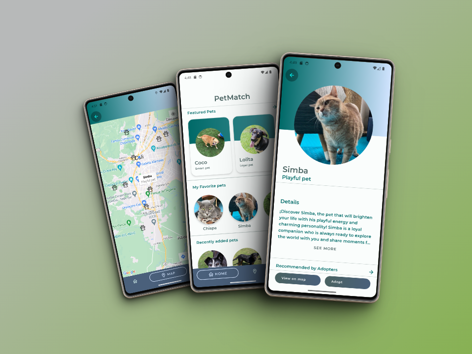
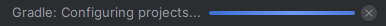
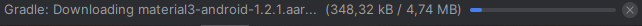
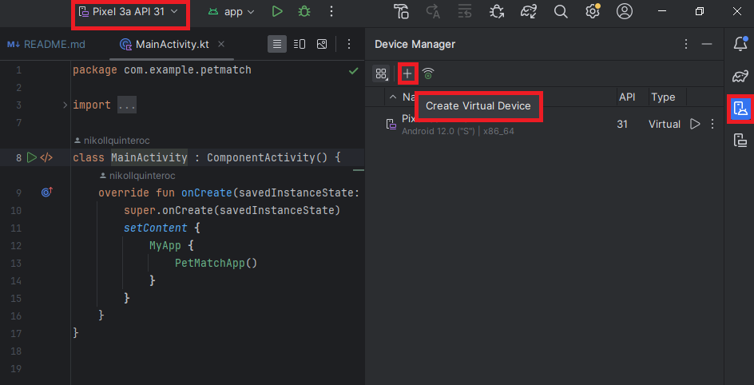
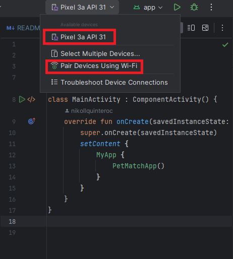
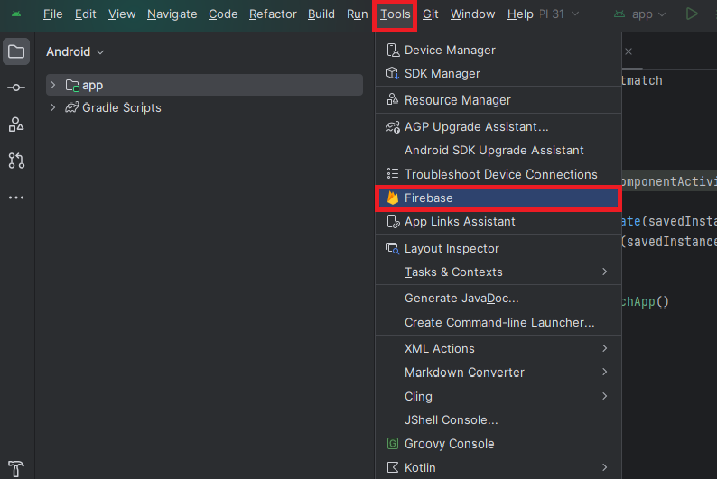
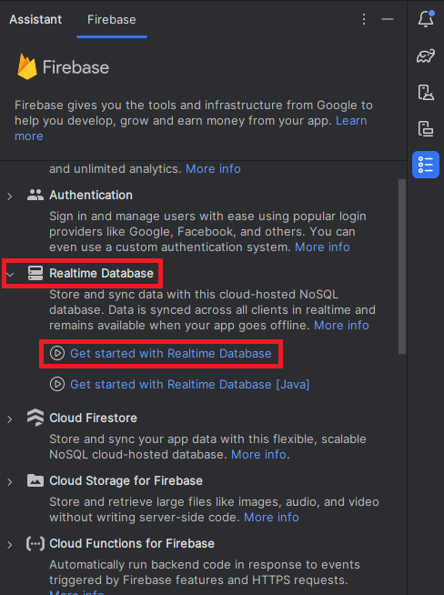

<a id= "petmatch"></a>
# PetMatch
PetMatch es una aplicación móvil innovadora que tiene como objetivo principal facilitar la adopción de mascotas y combatir el abandono animal, creando un puente entre los responsables de mascotas que buscan un hogar amoroso para sus carismáticos compañeros y adoptantes que desean abrirles las puertas de su corazón a un nuevo miembro de la familia.



## Un proyecto con un impacto positivo en la sociedad
Con esta aplicación queremos poner nuestro granito de arena para hacer de este mundo un lugar mejor, tanto para nosotros como para nuestros peludos y diversos compañeros. En particular queremos conseguir lo siguiente:

### Reducción del abandono animal
Al conectar a potenciales adoptantes con animales en busca de un hogar, se disminuye la cantidad de mascotas abandonadas en las calles, mejorando su calidad de vida y bienestar.

### Fomenta la responsabilidad y el amor por los animales 

La aplicación promueve la tendencia responsable de mascotas, educando a los adoptantes sobre los cuidados necesarios y creando conciencia sobre la importancia de brindarles un hogar lleno de afecto y seguridad.

### Fortalece la comunidad
PetMatch fomenta la unión entre personas que comparten el amor por los animales, creando una red de apoyo y colaboración para el cuidado y bienestar animal.


## Tabla de contenido
* [PetMatch](#petmatch)
* [Tecnologías utilizadas](#tecnologias-utilizadas)
* [Características](#caracteristicas)
* [Reglas de negocio](#reglas-negocio)
* [Configuración del entorno](#configuracion-entorno)
	* [Prerrequisitos](#prerrequisitos)
	* [Repositorio](#repositorio)
	* [Android Studio](#android-studio)
	* [Base de datos](#base-de-datos)
* [Equipo](#equipo)


<a id= "tecnologias-utilizadas"></a>
## Tecnologías utilizadas
- Kotlin - Jetpack Compose - MVVM - Coil
- Firebase suite - Auth - Realtime database.
- Gestión del proyecto: Jira, Slack y Discord


<a id= "caracteristicas"></a>
## Características
- Registro de usuarios.
- Autentificación de usuarios.
- Visualización de listado de mascotas.
- Visualización del perfil de las mascotas.
- Geolocalización del usuario para mostrarle mascotas cercanas que esten en adopción.
- Soporte de conexión entre responsable de la mascota y el que quiere adoptar.


<a id= "reglas-negocio"></a>
## Reglas de negocio
- Los roles válidos para un usuario son "Admin", "Pet Responsible" y "Adopter".


<a id= "configuracion-entorno"></a>
## Configuración del entorno
Para usar este proyecto es necesario realizar varias preparaciones.


<a id= "prerrequisitos"></a>
### Prerrequisitos
Para ejecutar el proyecto es necesario tener cuentas en plataformas específicas y tener instaladas algunas herramientas:


<a id= "repositorio"></a>
### Repositorio
Clona el repositorio en un directorio de tu conveniencia. Una forma de hacerlo es mediante comandos de consola.

```bash
cd <nombre del directorio del proyecto>
git clone <URL del repositorio>
```

<a id= "android-studio"></a>
### Android Studio
La primera vez que abras el proyecto hay que esperar a que Gradle haga las configuraciones y descarga necesarias.






Para poder ejecutar la aplicación es necesario una de las siguientes cosas:

1. Crear un dispositivo virtual.
2. Conectar un celular al emulador.

La opción 1 se hace mediante la opción "Device Manager" en el menú lateral. Durante la creación es necesario seleccionar el modelo del celular y la versión de android (hay que descargar una imagen del sistema operativo si no se ha hecho previamente).



La opción 2 se realiza mediante la lista desplegable de "Available devices" del menú superior y central.




<a id= "base-de-datos"></a>
### Base de datos
Necesitas tener una cuenta en Firebase para poder crear una base de datos y conectarla con el proyecto. 

Desde Android Studio es posible empezar el proceso de creación y conexión entre firebase y el proyecto, para ello hay que darle click a la opción "Tools" del menú superior y luego darle click a la opción "Firebase".



Esta opción abre un asistente que cuenta con la documentación necesaria para realizar la conexión. Despliega la sección "Realtime Database" y sigue los pasos indicados.




<a id= "equipo"></a>
## Equipo


<table align='center'>
	<tr>
    	<td align='center'>
      		<div >
        		<a href="https://github.com/nikollquinteroc" target="_blank" rel="author">
          			
        		</a>
        		<a href="https://github.com/nikollquinteroc" target="_blank" rel="author">
          			<h4 style="margin-top: 1rem;">Nikoll Quintero</br><small>Desarrolladora Android</small></h4>
        		</a>
        		<div style='display: flex; flex-direction: column'>
        			<a href="https://github.com/nikollquinteroc" target="_blank">
          				
        			</a>
        			<a href="https://www.linkedin.com/in/nikollquinteroc/" target="_blank">
          				
        			</a>
        		</div>
      		</div>
    	</td>
    	<td align='center'>
      		<div >
        		<a href="https://github.com/steven-04" target="_blank" rel="author">
          			
        		</a>
        		<a href="https://github.com/steven-04" target="_blank" rel="author">
          			<h4 style="margin-top: 1rem;">Steven Vergara</br><small>Desarrollador Android</small></h4>
        		</a>
        		<div style='display: flex; flex-direction: column'>
        			<a href="https://github.com/steven-04" target="_blank">
          				
        			</a>
        			<a href="https://www.linkedin.com/in/stevenvg04/" target="_blank">
						
        			</a>
        		</div>
      		</div>
    	</td>
		<td align='center'>
      		<div >
        		<a href="https://github.com/GonsaRa" target="_blank" rel="author">
          			
        		</a>
        		<a href="https://github.com/GonsaRa" target="_blank" rel="author">
          			<h4 style="margin-top: 1rem;">Maycol Rabanal</br><small>Desarrollador Android</small></h4>
        		</a>
        		<div style='display: flex; flex-direction: column'>
        			<a href="https://github.com/GonsaRa" target="_blank">
          				
        			</a>
        			<a href="https://www.linkedin.com/in/maycol-rabanal-marin-0b13a92bb/" target="_blank">
          				
        			</a>
        		</div>
      		</div>
    	</td>
		<td align='center'>
      		<div>
        		<a href="https://github.com/JormanPzC" target="_blank" rel="author">
          			
        		</a>
        		<a href="https://github.com/JormanPzC" target="_blank" rel="author">
          			<h4 style="margin-top: 1rem;">Jorman Paz Castillo</br><small>QA</small></h4>
        		</a>
        		<div style='display: flex; flex-direction: column'>
        			<a href="https://github.com/JormanPzC" target="_blank">
          				
        			</a>
        			<a href="https://www.linkedin.com/in/jormanpazcastillo/" target="_blank">
          				
        			</a>
        		</div>
      		</div>
    	</td>
	</tr>
</table>


<div style="text-align: right"> 
	<a href = "#petmatch" > Volver al inicio </a>
</div>


